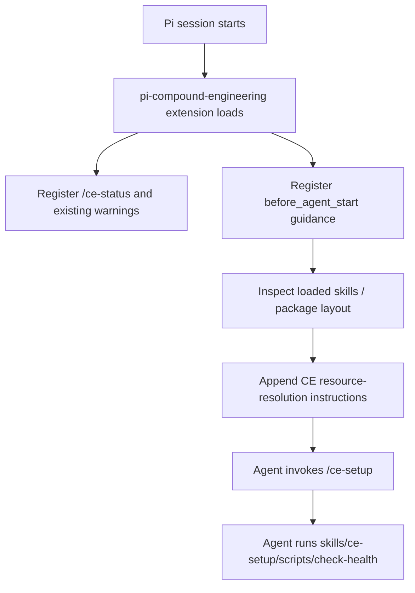

# fix: Improve Pi Compound Engineering setup fidelity

## Summary

Improve `pi-compound-engineering` through extension-only changes so CE skills keep their upstream text while Pi agents receive enough runtime context to resolve package skill resources correctly. The package should teach Pi where bundled CE `scripts/`, `references/`, and assets live, verify that the guidance is present, and avoid converter rewrites of upstream skill content for this pass.

---

## Problem Frame

Two `/ce-setup` sessions exposed a fidelity gap. In the Pi run, the agent first tried `scripts/check-health` from the package root and hit a missing-file error before discovering `skills/ce-setup/scripts/check-health`. It also split setup into more turns and showed more tool/resource discovery churn. In the Claude Code run, the skill had a clear skill base directory, ran its bundled script directly, and finished faster.

Skills are intended to be portable, so the first fix should be to improve the Pi package's runtime context rather than mutating generated skill bodies. `pi-compound-engineering` already owns an extension entry point, so it can inject package-specific guidance into the Pi system prompt and optionally expose resource lookup helpers without changing upstream CE content.

---

## Requirements

- R1. CE skills installed by this package must retain upstream skill content byte-for-byte except for existing generic converter behavior already required by the package.
- R2. Pi agents must receive clear runtime guidance that CE skill-local resources resolve under the package `skills/<skill-name>/` directory.
- R3. `/ce-setup` must be able to run its bundled `check-health` script on the first attempt when the generated package layout is valid.
- R4. The fix must live in package extension/runtime code, package tests, and docs, not in upstream CE source or committed generated skill directories.
- R5. Verification must catch missing runtime guidance and representative resource lookup behavior.
- R6. Documentation and changelog updates must explain that the package uses runtime context injection first and avoids skill-content rewrites for this pass.

---

## Key Technical Decisions

- KTD1. **Use extension-level system prompt context first:** Add Pi-only guidance from `packages/pi-compound-engineering/extensions/index.ts` or a helper in `src/` via `before_agent_start`. This targets the root cause: Pi agents need skill-resource resolution context at runtime.
- KTD2. **Do not add new converter rewrites for CE skill content:** Keep upstream skill text intact for this pass. Existing converter transforms for platform primitives remain, but no new `ce-setup` path rewrites or approval-flow rewrites should be added.
- KTD3. **Make guidance package-aware, not skill-specific where possible:** Explain the general rule for all CE skills and include a concrete `ce-setup` example. Include the current package install directory at runtime so shell commands can use absolute paths instead of depending on the project cwd.
- KTD4. **Optionally expose a resource lookup tool only if prompt guidance is insufficient:** A custom extension tool such as `ce_resource_path` can provide exact package-relative or absolute paths for bundled resources, but it adds surface area. Start with prompt guidance; add the tool only if testing shows agents still guess wrong.
- KTD5. **Verify runtime wiring, not generated prose mutation:** Tests should assert extension registration and prompt text behavior rather than expecting changed generated `SKILL.md` contents.

---

## Scope Boundaries

### In scope

- Extension/runtime changes under `packages/pi-compound-engineering/extensions/` and `packages/pi-compound-engineering/src/`.
- Tests under `packages/pi-compound-engineering/tests/` for the runtime guidance helper and optional tool schema/behavior.
- Structure checks in `packages/pi-compound-engineering/scripts/verify.mjs` only where they verify package layout needed by runtime guidance, not skill-content rewrites.
- Package docs and release notes under `packages/pi-compound-engineering/README.md`, `packages/pi-compound-engineering/CHANGELOG.md`, and package-local agent guidance if needed.

### Out of scope

- Changes to Every Inc.'s upstream `compound-engineering-plugin` repository.
- Committing generated `skills/`, `agents/`, or `THIRD-PARTY-NOTICES` into this monorepo.
- New converter rewrites that alter CE skill instructions for `ce-setup`, `ce-sessions`, approval prompts, or resource paths.
- Replacing Pi's core skill loader.
- Installing missing user tools as part of implementation.

---

## High-Level Technical Design

The extension should add a small, durable system prompt appendix for CE package skills. The appendix should be concise enough to avoid prompt bloat, but concrete enough that command examples in upstream CE skills are interpreted relative to the skill directory instead of the project cwd or package root.

---

## Implementation Units

### U1. Add CE resource guidance helper

**Goal:** Centralize the runtime instructions that tell Pi agents how to resolve CE skill resources.

**Requirements:** R2, R4, R6

**Dependencies:** None

**Files:**

- `packages/pi-compound-engineering/src/skill-resource-guidance.ts`
- `packages/pi-compound-engineering/src/index.ts`
- `packages/pi-compound-engineering/tests/skill-resource-guidance.test.mjs`

**Approach:**

- Create a pure helper that renders a concise instruction block for CE package skills.
- Include the general rule: for skills from `pi-compound-engineering`, resolve skill-local `scripts/`, `references/`, and `assets/` under `skills/<skill-name>/` in the package install directory.
- Include the concrete example: `/ce-setup` health check is at `skills/ce-setup/scripts/check-health`.
- Keep the pure helper package-relative by default, and allow the extension to pass the current package root so runtime guidance can include absolute shell command examples.
- Export the helper from `src/index.ts` for testability.

**Patterns to follow:**

- Existing small helpers in `packages/pi-compound-engineering/src/dependency-check.ts` and `src/status-command.ts`.
- Existing test style in `packages/pi-compound-engineering/tests/*.test.mjs`.

**Test Scenarios:**

- Rendered guidance mentions `skills/<skill-name>/` and `skills/ce-setup/scripts/check-health`.
- Rendered guidance does not include machine-specific absolute paths by default.
- Rendered guidance includes absolute shell command examples when the extension passes the package install directory.
- The helper output is short enough to be safe for every agent turn.

### U2. Inject guidance from the extension at agent start

**Goal:** Make the guidance available when a CE skill is invoked, without modifying generated skill content.

**Requirements:** R1, R2, R3, R4

**Dependencies:** U1

**Files:**

- `packages/pi-compound-engineering/extensions/index.ts`
- `packages/pi-compound-engineering/src/skill-resource-guidance.ts`
- `packages/pi-compound-engineering/tests/skill-resource-guidance.test.mjs`

**Approach:**

- Register a `before_agent_start` handler in the extension.
- Append the guidance to `event.systemPrompt` when CE skills are available in the session. A simple first pass can always append it from this package because the extension only loads when the package is installed; a refined version can inspect `event.systemPromptOptions.skills` to confirm loaded CE skills.
- Keep the block idempotent if multiple handlers or reloads occur by checking for a stable marker before appending.
- Do not inject a persistent user-visible message; system prompt guidance is enough and avoids transcript noise.

**Patterns to follow:**

- Pi extension docs for `before_agent_start` system prompt modification.
- Existing extension registration style in `packages/pi-compound-engineering/extensions/index.ts`.

**Test Scenarios:**

- A unit test or lightweight mocked event confirms the handler appends guidance once.
- Re-running the handler does not duplicate the guidance marker.
- Existing `/ce-status`, dependency checks, telemetry, and AGENTS block behavior remain unchanged.

### U3. Add an optional CE resource lookup tool only if needed

**Goal:** Provide an exact lookup path for bundled CE resources if prompt-only guidance is not reliable enough in manual testing.

**Requirements:** R2, R3, R4, R5

**Dependencies:** U1, U2

**Files:**

- `packages/pi-compound-engineering/extensions/index.ts`
- `packages/pi-compound-engineering/src/skill-resource-guidance.ts` or `packages/pi-compound-engineering/src/ce-resource-tool.ts`
- `packages/pi-compound-engineering/tests/skill-resource-guidance.test.mjs` or `tests/ce-resource-tool.test.mjs`

**Approach:**

- Defer this unit until after U2 manual testing. If agents still guess wrong, register a small `ce_resource_path` tool.
- Parameters: `skill` and `resource`, for example `skill="ce-setup"`, `resource="scripts/check-health"`.
- Return both package-relative and absolute path values, plus an existence boolean.
- Validate that the resolved path stays inside this package's generated `skills/` directory to avoid path traversal.
- Mention the tool in the guidance only if it is registered.

**Patterns to follow:**

- Pi extension docs for `pi.registerTool()` and TypeBox schemas.
- Existing dependency-check path resolution helpers where applicable.

**Test Scenarios:**

- `ce_resource_path({ skill: "ce-setup", resource: "scripts/check-health" })` resolves inside `skills/ce-setup/` and reports existence when generated skills are present.
- Path traversal attempts such as `resource="../../package.json"` are rejected.
- Missing resources return a clear not-found result without throwing uncaught errors.

### U4. Verify generated package layout supports the guidance

**Goal:** Ensure package installation still generates the resource paths that runtime guidance points agents toward.

**Requirements:** R3, R5

**Dependencies:** U1

**Files:**

- `packages/pi-compound-engineering/scripts/verify.mjs`
- `packages/pi-compound-engineering/tests/skill-resource-guidance.test.mjs`

**Approach:**

- Extend `verify.mjs` to assert that generated `skills/ce-setup/scripts/check-health` exists and is executable or readable as expected.
- Do not assert that `ce-setup/SKILL.md` has changed; it should remain upstream-derived.
- If U3 is implemented, add tests for the lookup helper using a temporary fake package layout so tests do not require network fetches.

**Patterns to follow:**

- Existing generated-output presence checks in `packages/pi-compound-engineering/scripts/verify.mjs`.
- Existing package tests that avoid network access.

**Test Scenarios:**

- `npm run verify --workspace packages/pi-compound-engineering` fails if `skills/ce-setup/scripts/check-health` is absent from generated output.
- Tests confirm helper/tool path construction matches the layout verified by `verify.mjs`.
- No test expects a rewritten `ce-setup/SKILL.md` command block.

### U5. Document the extension-only policy for this fix

**Goal:** Make the chosen strategy clear to future maintainers and upstream bump work.

**Requirements:** R1, R4, R6

**Dependencies:** U1, U2, U4

**Files:**

- `packages/pi-compound-engineering/README.md`
- `packages/pi-compound-engineering/CHANGELOG.md`
- `packages/pi-compound-engineering/AGENTS.md`

**Approach:**

- Add an Unreleased changelog entry explaining that CE skill resource resolution is improved through extension-provided runtime context.
- Update README troubleshooting or “How it works” text to explain that skills remain upstream-derived and the extension provides Pi resource-resolution guidance.
- Update package-local AGENTS guidance to prefer extension/runtime context before converter content rewrites for portability issues.

**Patterns to follow:**

- Existing `CHANGELOG.md` note that Pi-specific divergence belongs under `## [Unreleased]`.
- Existing `AGENTS.md` recipe-only model and no generated content rule.

**Test Scenarios:**

- Docs do not imply upstream CE files are modified.
- Docs mention the concrete `ce-setup` resource example only as a troubleshooting aid, not as a generated content patch.
- `npm run pack:dry-run --workspace packages/pi-compound-engineering` includes the changed docs and runtime files.

---

## Risks & Dependencies

- **Prompt guidance may be ignored:** Some models may still run bare `scripts/check-health`. Mitigation: keep the guidance concrete and add U3's lookup tool only if manual testing shows prompt-only guidance is insufficient.
- **Prompt bloat:** Adding context on every turn costs tokens. Mitigation: keep the block short and only append when this package extension is active, ideally when CE skills are loaded.
- **No direct control over shell cwd:** Extension guidance does not change where `bash` runs. Mitigation: runtime guidance includes the package install directory and absolute command examples; U3 can still provide structured lookup if needed.
- **Runtime-only fix may not help other harnesses:** This is intentional for the requested scope. Upstream portability improvements can be proposed separately later.

---

## Sources & Research

- Session `019ed4ba-11dd-73a7-9709-71532d86dbe1`: Pi `/ce-setup` initially failed on package-root `scripts/check-health`, then found `skills/ce-setup/scripts/check-health`, installed missing tools/skills, and completed after several approval turns.
- Session `f26f4dc1-0838-4354-882b-14842dbdaa51`: Claude Code `/ce-setup` used its skill base directory, ran setup with fewer resource-discovery steps, and completed faster in `pi-mono`.
- `packages/pi-compound-engineering/AGENTS.md`: package is recipe-only; generated CE content is not committed; Pi workarounds should preserve that model.
- `packages/pi-compound-engineering/extensions/index.ts`: existing extension entry point can register `before_agent_start` guidance alongside `/ce-status`, telemetry, dependency checks, and one-shot warnings.
- Pi extension docs: `before_agent_start` can append system prompt instructions, and `registerTool` can add optional custom lookup tools if guidance alone is insufficient.
